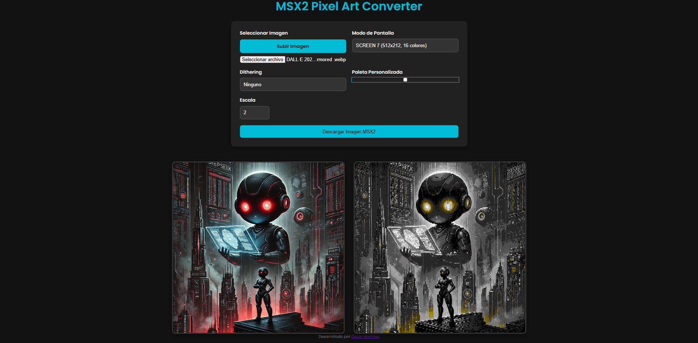

# MSX2 Pixel Art Converter ✨

**Transform your images into authentic 8-bit pixel art, MSX2 style!**

## 🕹️ About

This web application lets you convert your images into pixel art reminiscent of the classic **MSX2 8-bit computer** graphics. Relive the retro aesthetic or prepare your images for your next MSX2 project!  It respects the graphical limitations of the MSX2, using its iconic color palette and screen modes.

## 🌟 Key Features

*   **Authentic MSX2 Conversion:**  Faithfully converts images to pixel art respecting the MSX2's graphical rules.
*   **MSX2 Screen Mode Selection:** Choose from various MSX2 screen modes, each with its resolution and color limitations:
    *   SCREEN 2, 4, 5, 6, 7, 8
*   **Dithering Options:**  Enhance your pixel art with dithering techniques:
    *   None
    *   Floyd-Steinberg
    *   Bayer (Ordered)
*   **Customizable Palette:** Use the default MSX2 palette or create and fine-tune your own custom color palette for each conversion.
*   **Scale Factor:**  Scale up your pixel art for better visibility without losing the pixelated charm.
*   **Download Ready:**  Download your converted pixel art as a PNG image, ready to use!
*   **Web-Based & Easy to Use:**  No installation required! Works directly in your web browser.

## 🚀 How to Use

It's super simple!

1.  **Select Your Image:** Click the "Subir Imagen" button to upload the image you want to convert.
2.  **Choose MSX2 Screen Mode:** Select the desired MSX2 screen mode from the "Modo de Pantalla" dropdown to define the resolution and color palette limitations.
3.  **Dithering (Optional):**  Choose a dithering method from the "Dithering" dropdown to enhance color transitions and detail. Experiment to see what looks best!
4.  **Custom Palette (Optional):** Check "Paleta Personalizada" to tweak the color palette for your conversion.  Adjust the color swatches as needed.
5.  **Set Scale (Optional):** Adjust the "Escala" factor if you want to enlarge the pixel art output.
6.  **Download:** Click the "Descargar Imagen MSX2" button to download your retro pixel art masterpiece!

## 🎨 MSX2 Graphics Modes

The MSX2 was known for its vibrant and distinctive graphics, powered by the Yamaha V9938 VDP. This converter supports the following key screen modes:

| SCREEN Mode | Resolution   | Colors Available | Palette Size | Notes                                  |
|-------------|--------------|------------------|--------------|----------------------------------------|
| SCREEN 2    | 256 x 192    | 16               | 512          | Classic MSX2 16-color mode            |
| SCREEN 4    | 256 x 192    | 16               | 512          | Another 16-color mode                  |
| SCREEN 5    | 256 x 212    | 16               | 512          | Extended vertical resolution 16-color   |
| SCREEN 6    | 512 x 212    | 4                | 512          | High horizontal resolution, limited colors |
| SCREEN 7    | 512 x 212    | 16               | 512          | High horizontal resolution 16-color     |
| SCREEN 8    | 256 x 212    | 256              | 512          | 256-color mode, richest color palette    |

*(Palette of 512 colors available in all modes, but the number of usable colors simultaneously is limited by the SCREEN mode.)*

## 🖼️ Examples
### Vista Principal

*(Optional:  Add a section with examples of images before and after conversion to showcase the tool's capabilities. You can use before/after screenshots or even short GIFs.)*

## ✍️ Author

**Developed with ❤️ by @omrpps 2025**

## 📜 License

*(Optional: If you want to add a license, mention it here. For example:)*

This project is open-source and available under the [MIT License](LICENSE).

## 👍 Feedback & Contributions

Feel free to contribute to the project!  If you have any suggestions, bug reports, or want to add new features, please open an issue or submit a pull request.  Your feedback is welcome!
