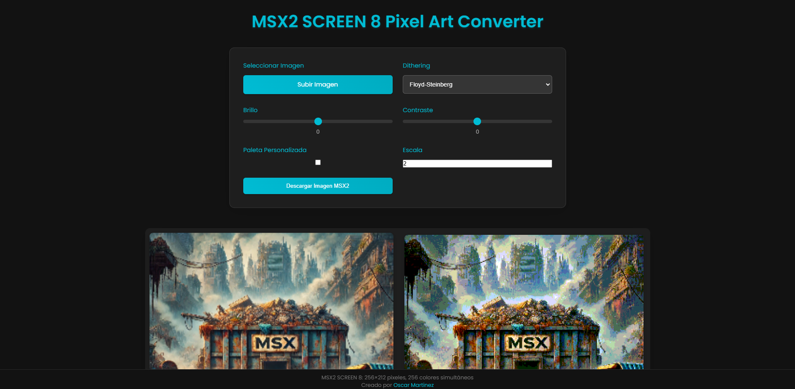

# MSX2 Pixel Art Converter ✨

**Transform your images into authentic 8-bit pixel art, MSX2 style!**

> *Replace the `screenshot.png` placeholder above with an actual screenshot or a cool GIF of your converter in action!  This is super important for making your README visually appealing.*

## 🕹️ About

This web application lets you convert your images into pixel art reminiscent of the classic **MSX2 8-bit computer** graphics. Relive the retro aesthetic or prepare your images for your next MSX2 project!  It respects the graphical limitations of the MSX2, using its iconic color palette and screen modes.

## 🌟 Key Features

*   **Authentic MSX2 Conversion:**  Faithfully converts images to pixel art respecting the MSX2's graphical rules.
*   **MSX2 SCREEN 8 Mode:** Optimized for SCREEN 8 mode, providing the richest color palette with 256 colors at 256 x 212 resolution.
*   **Dithering Options:**  Enhance your pixel art with dithering techniques:
    *   None
    *   Floyd-Steinberg
    *   Bayer (Ordered)
*   **Customizable Palette:** Use the default MSX2 palette or create and fine-tune your own custom color palette for each conversion.
*   **Scale Factor:**  Scale up your pixel art for better visibility without losing the pixelated charm.
*   **Download Ready:**  Download your converted pixel art as a PNG image, ready to use!
*   **Web-Based & Easy to Use:**  No installation required! Works directly in your web browser.

## 🚀 How to Use

It's super simple!

1.  **Select Your Image:** Click the upload button or drag and drop an image to convert.
2.  **Adjust Settings:** Fine-tune your conversion with these options:
    * **Dithering:** Choose your preferred dithering method for better color transitions
    * **Color Reduction:** Control how colors are mapped to the MSX2 palette
    * **Scale:** Adjust the output size of your pixel art
3.  **Preview & Download:** See your conversion in real-time and download when satisfied!

## 🎨 MSX2 SCREEN 8 Mode

This converter is optimized for MSX2's SCREEN 8 mode, which offers:

* **Resolution:** 256 x 212 pixels
* **Colors:** 256 colors simultaneously
* **Palette:** Rich color depth perfect for detailed pixel art
* **Compatibility:** Ideal for MSX2 and above computers

SCREEN 8 is the most versatile MSX2 graphics mode, allowing for detailed artwork with smooth color gradients and minimal color limitations.

## 🖼️ Examples
### Vista Principal

*(Optional:  Add a section with examples of images before and after conversion to showcase the tool's capabilities. You can use before/after screenshots or even short GIFs.)*

## ✍️ Author

**Developed with ❤️ by @omrpps 2025**

## 📜 License

*(Optional: If you want to add a license, mention it here. For example:)*

This project is open-source and available under the [MIT License](LICENSE).

## 👍 Feedback & Contributions

Feel free to contribute to the project!  If you have any suggestions, bug reports, or want to add new features, please open an issue or submit a pull request.  Your feedback is welcome!
